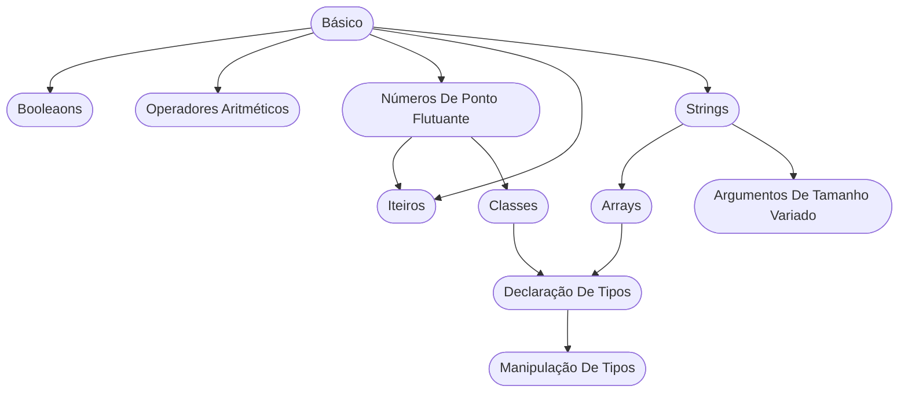

<strong>Básico</strong>
<strong>Exercício:</strong> lasagna

<strong>Booleaons</strong>
<strong>Exercício:</strong> annalyns-infiltration

<strong>Operadores Aritméticos</strong>
<strong>Exercício:</strong> pizza-pi

<strong>Números De Ponto Flutuante</strong>
<strong>Exercício:</strong> pizza-pi

<strong>Iteiros</strong>
<strong>Exercício:</strong> pizza-pi

<strong>Strings</strong>
<strong>Exercício:</strong> sweethearts

<strong>Arrays</strong>
<strong>Exercício:</strong> language-list

<strong>Classes</strong>
<strong>Exercício:</strong> windowing-system

<strong>Argumentos De Tamanho Variado</strong>
<strong>Exercício:</strong> language-list

<strong>Declaração De Tipo</strong>
<strong>Exercício:</strong> city-office

<strong>Manipulação De Tipos</strong>
<strong>Exercício:</strong> lucky-numbers

